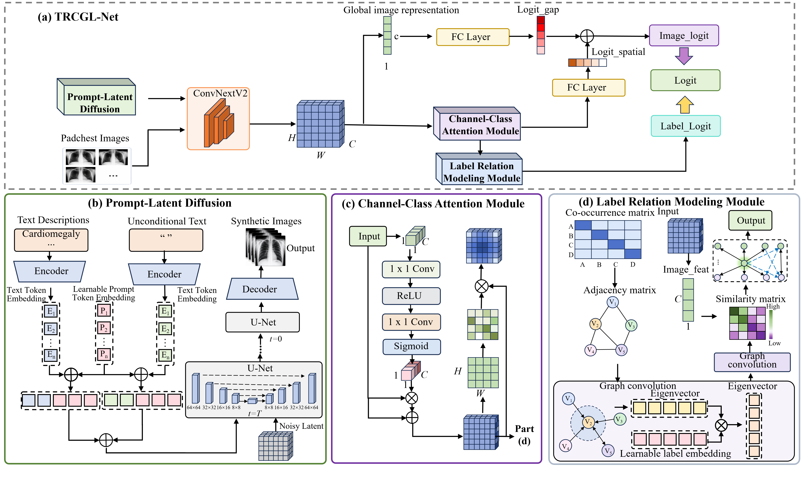

# TRCGL-Net
### A Long-Tailed Multi-Label Chest X-Ray Classification Framework with Generative Data Augmentation and Label Co-Occurrence Modeling

<p align="center">
  
</p>

## Overview

This repository provides the official implementation of **TRCGL-Net**, a long-tailed multi-label chest X-ray classification framework designed to improve recognition performance for rare diseases under severe class imbalance.

TRCGL-Net addresses three major challenges in chest X-ray multi-label classification:

1. **Severe tail-class sample scarcity**
2. **Weak lesion representation under complex anatomical backgrounds**
3. **Insufficient exploitation of disease label relationships**

The proposed framework integrates:

- **Text-guided conditional diffusion generation**
  - Generates semantic-consistent synthetic chest X-ray images for tail classes.
  - Alleviates data imbalance by augmenting rare disease categories.

- **Channel-Class Attention Module**
  - Enhances disease-related feature channels.
  - Generates class-specific attention maps to focus on lesion regions.

- **Label Relation Modeling Module**
  - Constructs a disease co-occurrence graph.
  - Uses graph convolution to propagate discriminative information among related diseases.

According to the paper, TRCGL-Net achieves:

- **mAP: 0.4408**
- **mAUC: 0.8989**
- **Macro-F1: 0.4369**

on the PadChest dataset.

For tail classes:

- **Tail-class mAP: 0.4904**
- **Tail-class mAUC: 0.9229**

---

# Method

The overall framework consists of three main components:

<p align="center">
  
</p>


## 1. Text-guided Conditional Diffusion Generation

A learnable text-guided diffusion model is introduced to synthesize tail-class chest X-ray images.

Disease labels and radiology descriptions are converted into semantic embeddings and used as conditions for image generation.

The generated samples are combined with real images to improve tail-class representation learning.


## 2. Channel-Class Attention

A ConvNeXtV2 backbone extracts visual features.

The Channel-Class Attention module contains:

- Channel reweighting
- Class-aware spatial attention

It enhances discriminative lesion-related features while reducing interference from irrelevant anatomical structures.


## 3. Label Co-Occurrence Graph Modeling

A label relationship graph is constructed based on disease co-occurrence statistics.

Graph convolutional networks are used to propagate semantic information among related disease categories, improving multi-label prediction consistency.

---

# Dataset

## PadChest Dataset

TRCGL-Net is evaluated on the PadChest chest X-ray dataset.

Dataset website:

https://bimcv.cipf.es/bimcv-projects/padchest/


The dataset contains:

- More than 160,000 chest X-ray images
- Over 67,000 patients
- 174 radiological findings
- Multi-label disease annotations

# Training

TRCGL-Net adopts a two-stage training strategy within a single training process.

1. **Classifier warm-up stage**
   - The backbone network is frozen.
   - Only the classification head and label relation modeling module are optimized.

2. **Full fine-tuning stage**
   - The whole network is unfrozen.
   - All modules are jointly optimized.

The two stages are automatically executed inside the training script. Users only need to run a single training command.

## Train

Single GPU training:

```bash
CUDA_VISIBLE_DEVICES=0 nohup torchrun \
--nproc_per_node=1 \
--rdzv_endpoint=localhost:29512 \
CXR.py \
> logs/cxr.log 2>&1 &
